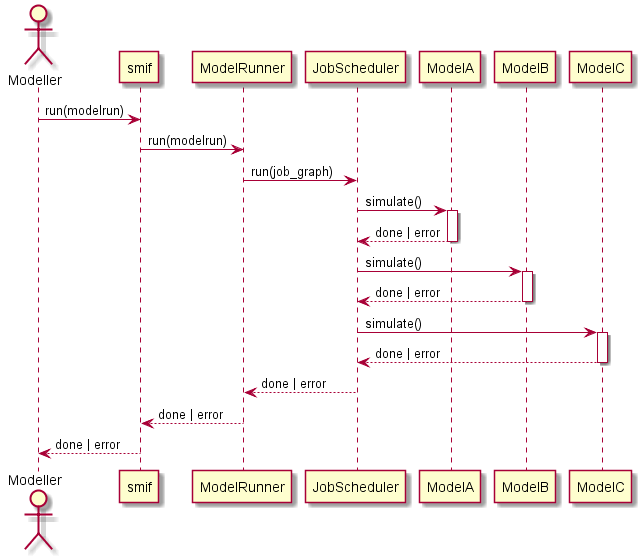

# Developing <span class="title-ref">smif</span>

_smif_ is under active development at
[github.com/nismod/smif](https://github.com/nismod/smif)

## Install

The `smif` codebase is contained in `src/smif`.

Install the library in develop mode using the command:

    pip install -e .

## Testing

We use [pytest](http://doc.pytest.org/en/latest/) for testing, with
tests under `tests/` matching the module and class structure of `smif/`.

Install requirements for testing:

    pip install -r test-requirements.txt

Run tests:

    python -m pytest tests

## Integration testing

The smif test suite includes a number of integration tests: -
`tests/cli` contains a few system integration tests, running small
models using the smif command-line interface - `tests/data_layer`
contains data store integration tests which interact with data stores -
including the filesystem and a database.

To run Postgres database integration tests, you will need: - a Postgres
installation, (currently testing on 9.6 or greater) - a `test_smif`
database, and a user with login and permissions to create and drop
tables on the database - to set the `PG...` [environment
variables](https://www.postgresql.org/docs/current/libpq-envars.html)
before running the tests

For example, assuming Postgres is installed and your user has database
creation rights:

    createdb test_smif
    export PGHOST=localhost
    export PGPORT=5432
    export PGUSER=username
    export PGPASSWORD=password
    python -m pytest tests/data_layer

## Documentation

We use
[sphinx.ext.apidoc](https://www.sphinx-doc.org/en/master/usage/extensions/apidoc.html)
for building documentation under `smif/docs` and the [Numpy style
docstrings](https://github.com/numpy/numpy/blob/master/doc/example.py) that are
used throughout the codebase. Documentation is generated and hosted on
[readthedocs](http://smif.readthedocs.org).

There is a Makefile to building the docs locally, with options for multiple
formats:

    cd docs/
    make html

This generates a local version in `smif/docs/_build/html` that can be
opened with a browser.

## Versioning

We intend to follow [semantic versioning](http://semver.org/), with
major versions for any incompatible changes to the public API. Note that
tags should follow [PEP440](https://www.python.org/dev/peps/pep-0440/)
which has stricter constraints on tags than semantic versioning.

## Releases

[smif](https://pypi.python.org/pypi/smif) is deployed as a package on
the Python Package Index, PyPI. A full guide to
[packaging](https://packaging.python.org/distributing/) and distributing
projects is available online.

Deployment to PyPI is handled by Travis CI, and versions are controlled
by git tags. Deployment to conda is via the conda-forge smif feedstock.

To make a release:

- \[ \] create a release branch
- \[ \] update CHANGELOG with notes on features and fixes since last
  release.
- \[ \] update AUTHORS if necessary
- \[ \] create and push an annotated tag
- \[ \] open a pull request
- \[ \] wait (~15 minutes) for tests to pass
- \[ \] check that deploy stage ran as expected, new version available
  on <https://pypi.org/project/smif/#history>
- \[ \] create a GitHub release for the tag
- \[ \] wait (~1 day) for conda bot to open PR on
  <https://github.com/conda-forge/smif-feedstock>
- \[ \] check dependencies/versions/lints and merge to release conda
  package

To update the `CHANGELOG.md` with a short summary of fixes and new
features. Commit message summaries should give a reasonable starting
point:

    git log v1.1.0..HEAD --oneline

To create and push a tag:

    git tag -a v0.2.0         # create annotated tag (will need a message)
    git describe              # show current commit in relation to tags
    git push upstream v0.2.0  # push the tag to a remote (typically upstream or origin)

To create a release on GitHub: go to
<https://github.com/nismod/smif/releases/new> and enter the same tag
name as above. Reuse the CHANGELOG text for the description.

## Code style

Linting is handled by [pre-commit](http://pre-commit.com/) hooks, which
can be installed from the root of the repository using:

    pre-commit install

Use [black](https://black.readthedocs.io/en/stable/) to format code.

Use [mypy](https://mypy.readthedocs.io/en/stable/index.html) to type check.
Install type packages before running mypy to report on typing. Current
situation is only partially typed, check will report various errors:

    mypy --install-types
    mypy .

## Errors and messages

As a general guideline, [smif](https://pypi.python.org/pypi/smif) fails
fast, with errors that users can understand in context, whether they
call smif through the python api or CLI.

When handling errors, we raise custom exceptions (with an informative
name and message) which can be communicated out through STDERR.

In normal operations, we catch all errors from the standard library and
other dependencies close to where they may arise, re-raising with a
custom <span class="title-ref">SmifException</span> if it can't be
handled directly.

For example:

```python
try:
    networkx.topological_sort(graph)
except networkx.NetworkXUnfeasible as err:
    raise SmifNotImplementedError("JobGraphs must not contain cycles") from err
```

Error messages should contain concrete details from the immediate
context if brief and relevant. This might include names and small
values, but not lists or serialisations of large or even medium-sized
data structures. Errors and messages can be extended with extra context
if we catch and re-raise further up the stack.

## Error boundaries

There are three major boundaries where we catch and handle errors: -
around a job (a call to <span class="title-ref">Model.simulate</span>) -
independent jobs shouldn't cause others to fail - around a modelrun -
independent modelruns shouldn't cause others to fail - around the smif
process - errors should be reported, followed by a clean exit if the
process cannot continue.

[](uml/error_boundaries.png)

At program boundaries, we catch anything inheriting from
<span class="title-ref">SmifException</span> and pass on the message.
Stack traces are only shown if running in debug mode, or as the result
of a programming error (we missed something - it's a bug).

## Logging

Log messages should be used sparingly, following the
<span class="title-ref">python
guidelines</span>\<<https://docs.python.org/3/howto/logging.html#when-to-use-logging>\>:

- print() displays console output for ordinary usage of the CLI
- CRITICAL errors are the last thing logged before a daemon is forced to
  quit (scheduler or server process)
- ERROR level errors are communicated to user, typically causing jobs,
  requests or batch jobs to fail.
- WARN indicates an event that a client may not be able or need to do
  anything about -including error handling and unexpected events
  (failover, fallback). Use <span class="title-ref">warnings.warn</span>
  if client code should be modified, for example if deprecating a
  method.
- INFO reports on events that occur during normal operation (e.g.
  start/stop modelrun, jobs)
- DEBUG records events at a finer grain. Prefer introducing debug
  statements temporarily for debugging, but not to commit them without
  justification.

CRITICAL, ERROR and WARN are shown with any verbosity level, and we
should not typically expect to see any of them.

INFO messages are shown at the first level of verbosity
(<span class="title-ref">-v</span>).

DEBUG messages are shown at the second level of verbosity
(<span class="title-ref">-vv</span>).

## Module import relationship diagram

[](uml/packages_smif.png)

## Class diagrams

[](uml/classes_smif.png)

## Decision - simulation class interaction/interface design

[](uml/decision-simulation.png)

## Data flow

Locating the data required by a particular simulation model could become
complicated. A data input may be provided as scenario data or as the
output from another model. Scenario data vary between model runs as
different scenarios are explored. Model outputs vary between model runs
and possibly within model runs, as coupled models iterate to find stable
solutions to loops in the dependency graph or as decision algorithms run
multiple simulations to explore possible interventions.

The two abstractions introduced are a `DataInterface` and a
`DataHandle`. A `DataInterface` has responsibility for accessing and
persisting data and results, for example to a file system or database. A
`DataHandle` has responsibility for directing a simulation model's
requests to the correct dataset, given the modelrun, requesting model,
particular spatial or temporal resolution, and current iteration state.
The containing layers - `ModelRun`, `SosModel`, `ModelSet` - must
incrementally add and update details when creating a specialised
`DataHandle` to pass in to each simulation model.

[](uml/data_flow.png)

This class diagram show part of the API to `DataInterface` and the
smaller API to `DataHandle` which internally makes use of `DataHandle`'s
private attributes.

[](uml/data_handle.png)
