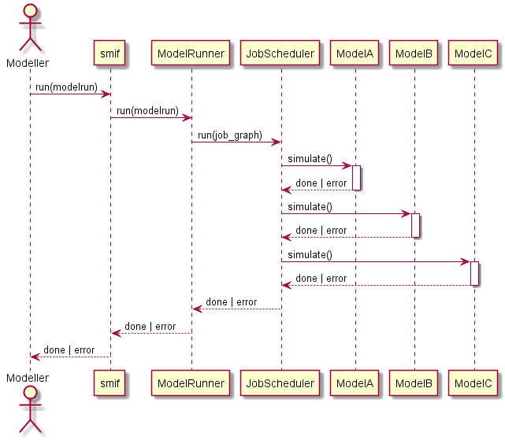

.. _developers:

Developing `smif`
=================

*smif* is under active development at `github.com/nismod/smif`_

Install
-------

The :code:`smif` codebase is contained in ``src/smif``.

Install the library in develop mode using the command::

    python setup.py develop

If you also wish to use the GUI while using smif in develop mode, you'll need
to navigate to the ``src/smif/app`` folder and run the commands::

    npm install
    npm run build

Testing
-------

We use `pytest`_ for testing, with tests under :code:`tests/` matching the module
and class structure of :code:`smif/`.

Install requirements for testing::

    pip install -r test-requirements.txt

Run tests::

    python setup.py test

Integration testing
-------------------

The smif test suite includes a number of integration tests:
- ``tests/cli`` contains a few system integration tests, running small models using the smif
  command-line interface
- ``tests/data_layer`` contains data store integration tests which interact with data stores -
  including the filesystem and a database.

To run Postgres database integration tests, you will need:
- a Postgres installation, (currently testing on 9.6 or greater)
- a ``test_smif`` database, and a user with login and permissions to create and drop tables on
  the database
- to set the ``PG...``
  `environment variables <https://www.postgresql.org/docs/current/libpq-envars.html>`_
  before running the tests

For example, assuming Postgres is installed and your user has database creation rights::

    createdb test_smif
    export PGHOST=localhost
    export PGPORT=5432
    export PGUSER=username
    export PGPASSWORD=password
    python -m pytest tests/data_layer

Documentation
-------------

We use `better-apidoc <https://github.com/goerz/better-apidoc>`_ for building
documentation in reStructuredText under :code:`smif/docs` and the
`Numpy style docstrings <https://github.com/numpy/numpy/blob/master/doc/example.py>`_
that are used throughout the codebase. Documentation is generated and hosted
on `readthedocs <http://smif.readthedocs.org>`_.

Setuptools should allow for building the docs from the project root::

    python setup.py docs

There is a also a Makefile to building the docs locally, with options for multiple formats::

    cd docs/
    make html

This generates a local version in :code:`smif/docs/_build/html` that can be opened with a
browser.

Versioning
----------

We intend to follow `semantic versioning`_, with
major versions for any incompatible changes to the public API.
Note that tags should follow `PEP440`_ which has stricter
constraints on tags than semantic versioning.

Releases
--------

`smif`_ is deployed as a package on the Python Package Index, PyPI. A full guide
to `packaging`_ and distributing projects is available online.

Deployment to PyPI is handled by Travis CI.

To make a release, create an annotated tag, and submit a pull request::

    git tag -a v0.2.0       # create annotated tag (will need a message)
    git describe            # show current commit in relation to tags

You'll need to specify you tag to push either using the ``--tags`` flag or
the tag name::

    git push upstream master --tags
    git push upstream v0.2.0        # alternatively

Code style
----------

Linting is handled by `pre-commit`_ hooks, which can be installed from the root
of the repository using::

    pre-commit install

Errors and messages
-------------------

As a general guideline, `smif`_ fails fast, with errors that users can understand in
context, whether they call smif through the python api, CLI, HTTP API or GUI.

When handling errors, we raise custom exceptions (with an informative name and
message) which can be communicated out through STDERR, HTTP response or error box.

In normal operations, we catch all errors from the standard library and other
dependencies close to where they may arise, re-raising with a custom `SmifException` if it
can't be handled directly.

For example:

.. code:: python

    try:
        networkx.topological_sort(graph)
    except networkx.NetworkXUnfeasible as err:
        raise SmifNotImplementedError("JobGraphs must not contain cycles") from err

Error messages should contain concrete details from the immediate context if brief and
relevant. This might include names and small values, but not lists or serialisations of large
or even medium-sized data structures. Errors and messages can be extended with extra context
if we catch and re-raise further up the stack.

Error boundaries
----------------

There are three major boundaries where we catch and handle errors:
- around a job (a call to `Model.simulate`) - independent jobs shouldn't cause others to fail
- around a modelrun - independent modelruns shouldn't cause others to fail
- around the smif process - errors should be reported, followed by a clean exit if the process
  cannot continue.

At program boundaries, we catch anything inheriting from `SmifException` and pass on the
message. Stack traces are only shown if running in debug mode, or as the result of a
programming error (we missed something - it's a bug).

Logging
-------

Log messages should be used sparingly, following the
`python guidelines`<https://docs.python.org/3/howto/logging.html#when-to-use-logging>:

- print() displays console output for ordinary usage of the CLI (respond with a message or
  similar usual channel for API/GUI)
- CRITICAL errors are the  last thing logged before a daemon is forced to quit (scheduler or
  server process)
- ERROR level errors are communicated to user, typically causing jobs, requests or batch
  jobs to fail.
- WARN indicates an event that a client may not be able or need to do anything about -
  including error handling and unexpected events (failover, fallback). Use `warnings.warn`
  if client code should be modified, for example if deprecating a method.
- INFO reports on events that occur during normal operation (e.g. start/stop modelrun, jobs)
- DEBUG records events at a finer grain. Prefer introducing debug statements temporarily for
  debugging, but not to commit them without justification.

CRITICAL, ERROR and WARN are shown with any verbosity level, and we should not typically expect
to see any of them.

INFO messages are shown at the first level of verbosity (`-v`).

DEBUG messages are shown at the second level of verbosity (`-vv`).

Module import relationship diagram
----------------------------------

.. image:: uml/packages_smif.png
    :alt: smif module/submodule diagram
    :target: _images/packages_smif.png

Class diagrams
--------------

.. image:: uml/classes_smif.png
    :alt: smif class diagram
    :target: _images/classes_smif.png

Decision - simulation class interaction/interface design
--------------------------------------------------------

.. image:: uml/decision-simulation.png
    :alt: UML for smif decision and simulation interaction
    :target: _images/decision-simulation.png

Data flow
---------

Locating the data required by a particular simulation model could become
complicated. A data input may be provided as scenario data or as the
output from another model. Scenario data vary between model runs as different
scenarios are explored. Model outputs vary between model runs and possibly
within model runs, as coupled models iterate to find stable solutions to
loops in the dependency graph or as decision algorithms run multiple simulations
to explore possible interventions.

The two abstractions introduced are a ``DataInterface`` and a ``DataHandle``. A
``DataInterface`` has responsibility for accessing and persisting data and
results, for example to a file system or database. A ``DataHandle`` has
responsibility for directing a simulation model's requests to the correct
dataset, given the modelrun, requesting model, particular spatial or temporal
resolution, and current iteration state. The containing layers - ``ModelRun``,
``SosModel``, ``ModelSet`` - must incrementally add and update details when
creating a specialised ``DataHandle`` to pass in to each simulation model.

.. image:: uml/data_flow.png
    :alt: Sequence diagram for smif data flow
    :target: _images/data_flow.png

This class diagram show part of the API to ``DataInterface`` and the smaller API
to ``DataHandle`` which internally makes use of ``DataHandle``'s private
attributes.

.. image:: uml/data_handle.png
    :alt: Class diagram for smif DataHandle / DataInterface composition
    :target: _images/data_handle.png

.. _PEP440: https://www.python.org/dev/peps/pep-0440/
.. _packaging: https://packaging.python.org/distributing/
.. _github.com/nismod/smif: https://github.com/nismod/smif
.. _pytest: http://doc.pytest.org/en/latest/
.. _semantic versioning: http://semver.org/
.. _pre-commit: http://pre-commit.com/
.. _PyPI: https://pypi.python.org/pypi
.. _smif: https://pypi.python.org/pypi/smif
