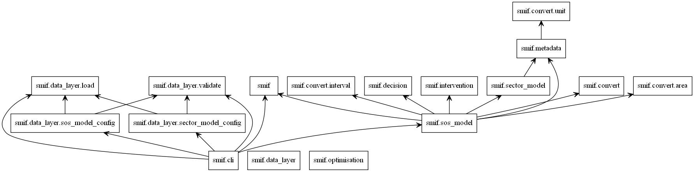
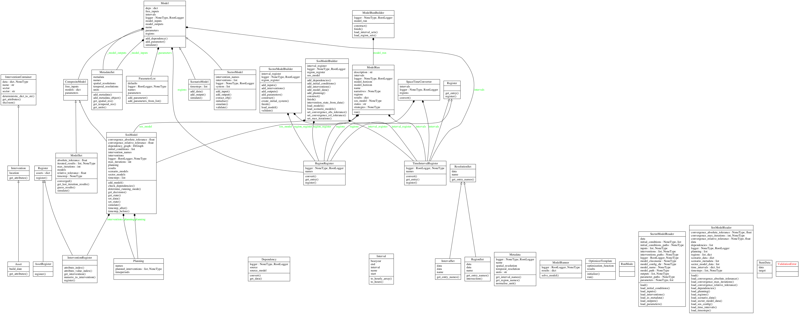
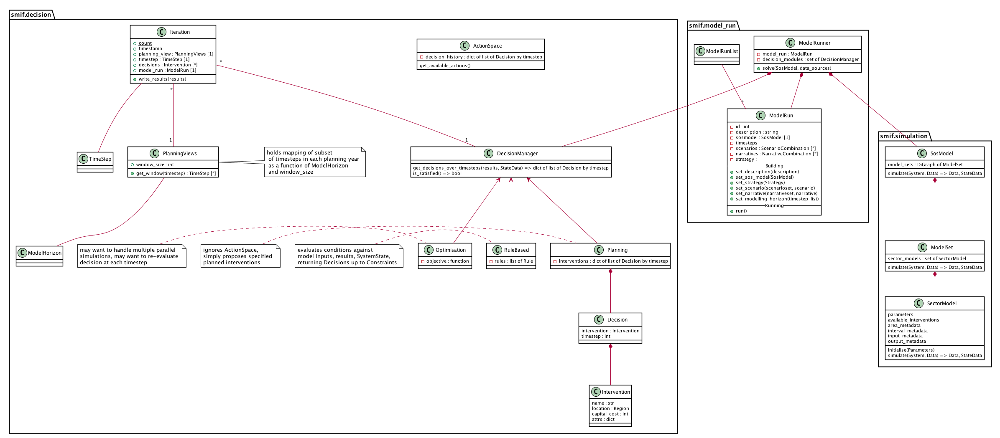
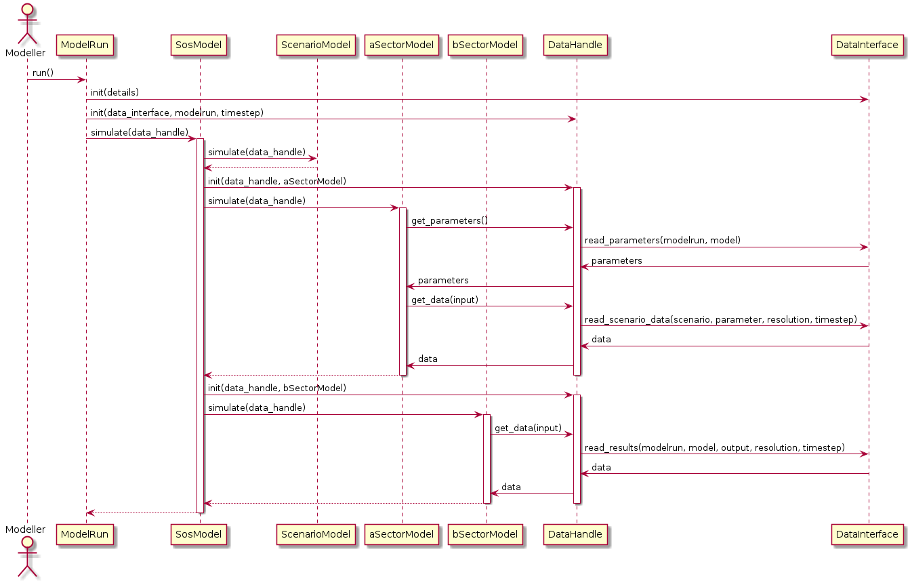
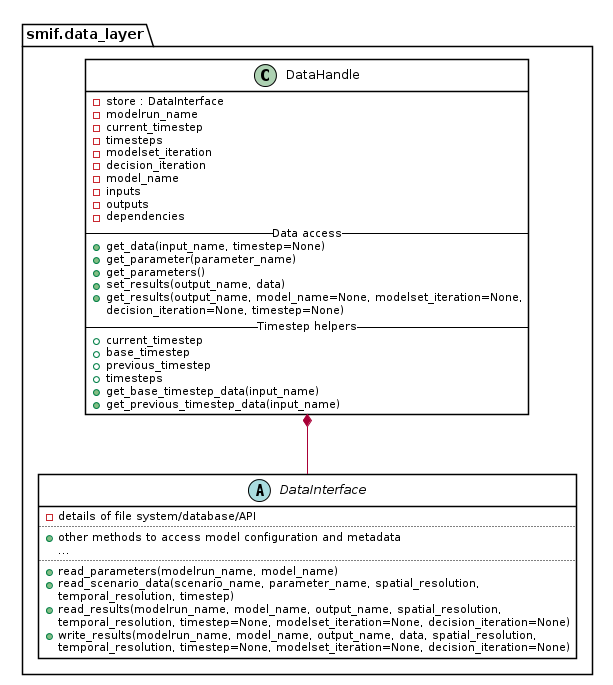

.. _developers:

Developing `smif`
=================

*smif* is under active development at `github.com/nismod/smif`_

Install
-------

The :code:`smif` codebase is contained in ``src/smif``.

Install the library in develop mode using the command::

    python setup.py develop

If you also wish to use the GUI while using smif in develop mode, you'll need
to navigate to the ``src/smif/app`` folder and run the commands::

    npm install
    npm run build

Testing
-------

We use `pytest`_ for testing, with tests under :code:`tests/` matching the module
and class structure of :code:`smif/`.

Install requirements for testing::

    pip install -r test-requirements.txt

Run tests::

    python setup.py test

Versioning
----------

:code:`smif` is currently pre-1.0, so API and usage are liable to change. After
releasing a first major version, we intend to follow `semantic versioning`_, with
major versions for any incompatible changes to the public API.

Releases
--------

`smif`_ is deployed as a package on the Python Package Index, PyPI. A full guide
to `packaging`_ and distributing projects is available online.

Deployment to PyPI is handled by Travis CI.

To make a release, create an annotated tag, and submit a pull request::

    git tag -a v0.2.0       # create annotated tag (will need a message)
    git describe            # show current commit in relation to tags

You'll need to specify you tag to push either using the ``--tags`` flag or
the tag name::

    git push upstream master --tags
    git push upstream v0.2.0        # alternatively

Conventions
-----------

The `numpydoc`_ docstring conventions are used for inline documentation, which
is used to generate the module reference documentation visible at `readthedocs`_
and which can also be generated by running ``python setup.py docs``

Linting is handled by `pre-commit`_ hooks, which can be installed from the root
of the repository using::

    pre-commit install

Module import relationship diagram
----------------------------------

Class diagrams
--------------

Decision - simulation class interaction/interface design
--------------------------------------------------------

Data flow
---------

Locating the data required by a particular simulation model could become
complicated. A data input may be provided as scenario data or as the
output from another model. Scenario data vary between model runs as different
scenarios are explored. Model outputs vary between model runs and possibly
within model runs, as coupled models iterate to find stable solutions to
loops in the dependency graph or as decision algorithms run multiple simulations
to explore possible interventions.

The two abstractions introduced are a ``DataInterface`` and a ``DataHandle``. A
``DataInterface`` has responsibility for accessing and persisting data and
results, for example to a file system or database. A ``DataHandle`` has
responsibility for directing a simulation model's requests to the correct
dataset, given the modelrun, requesting model, particular spatial or temporal
resolution, and current iteration state. The containing layers - ``ModelRun``,
``SosModel``, ``ModelSet`` - must incrementally add and update details when
creating a specialised ``DataHandle`` to pass in to each simulation model.

This class diagram show part of the API to ``DataInterface`` and the smaller API
to ``DataHandle`` which internally makes use of ``DataHandle``'s private
attributes.

.. _packaging: https://packaging.python.org/distributing/
.. _github.com/nismod/smif: https://github.com/nismod/smif
.. _pytest: http://doc.pytest.org/en/latest/
.. _semantic versioning: http://semver.org/
.. _numpydoc: https://github.com/numpy/numpy/blob/master/doc/HOWTO_DOCUMENT.rst.txt
.. _readthedocs: http://smif.readthedocs.io/en/latest/
.. _pre-commit: http://pre-commit.com/
.. _PyPI: https://pypi.python.org/pypi
.. _smif: https://pypi.python.org/pypi/smif
