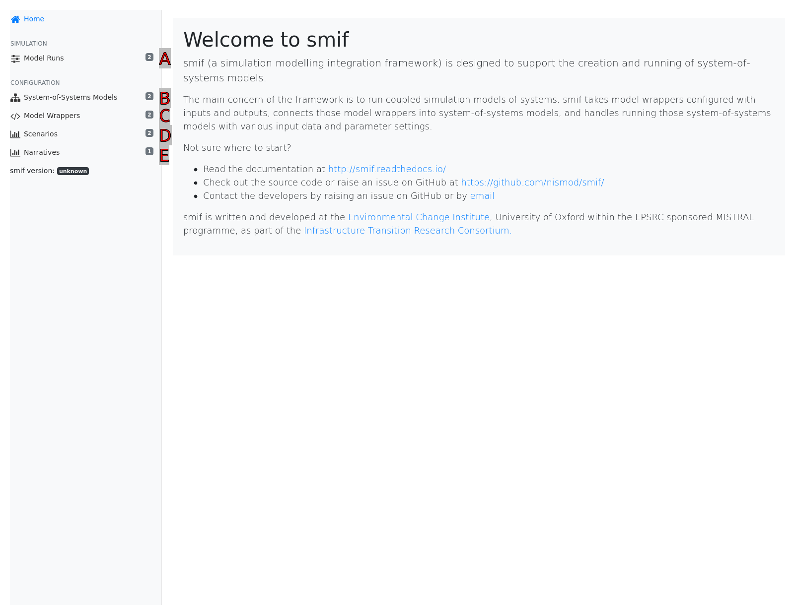
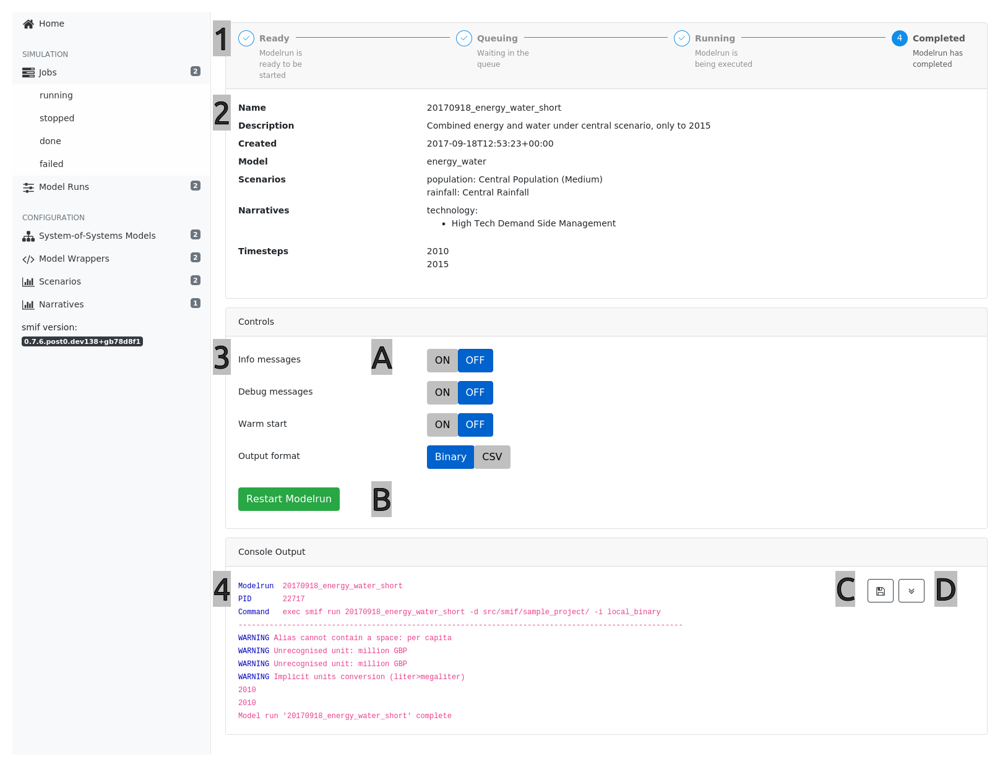

.. _getting_started:

Getting Started
===============

Once you have installed **smif** (see :ref:`Installation and Configuration`), the quickest way
to get started is to use the sample project.

This section walks through setting up the sample project and extending it to configure models
and data.

If you prefer to start with an overview of the concepts that **smif** uses, these are
documented in :ref:`Concepts`.

Setup
-----

First, check smif has installed correctly by typing on the command line::

    $ smif
    usage: smif [-h] [-V] [-v] {setup,list,app,run} ...

    Command line tools for smif

    positional arguments:
    {setup,list,app,run}  available commands
        setup               Setup the project folder
        list                List available model runs
        app                 Open smif app
        run                 Run a model

    optional arguments:
    -h, --help            show this help message and exit
    -V, --version         show the current version of smif
    -v, --verbose         show messages: -v to see messages reporting on
                            progress, -vv to see debug messages.

You can also check which version is installed::

    $ smif --version
    smif 1.0

.. topic:: Command-line examples

    Commands that can be run in a terminal or command line are written prefixed with a $. This
    means you can copy the rest of the line to run - don't copy or type the $ itself.

Sample Project
--------------

Make a new directory and copy the sample project files there by running:

.. code:: console

    $ mkdir sample_project
    $ cd sample_project
    $ smif setup
    $ ls
    config/ data/ models/ planning/ results/ smif.log

On the command line, from within the project directory, type the following
command to list the available model runs::

    $ smif list
    energy_central
    energy_water_cp_cr

Note that the ``-d`` directory flag can be used to point to the project folder,
so you can run smif commands from any directory::

    $ smif list -d ~/projects/smif_sample_project/
    ...

smif also comes with a web-based user interface, which helps to manage project configurations.
The app can be started within a project configuration directory::

    $ smif app
    Opening smif app

    Copy/paste this URL into your web browser to connect:
        http://localhost:5000

    Close your browser then type Control-C here to quit.

Copy/paste or type the URL ``http://localhost:5000`` into a web browser to open the app.

.. <<This figure can be regenerated using the script in docs/gui/screenshot.sh>>

    The Smif app welcome screen

.. topic:: Hints

    [A] Model Runs - model configurations to run (or which have been run in the past)

    [B] System-of-Systems models -  integrated models which can be configured and run

    [C] Model Wrappers - individual models which can be composed into System-of-Systems models

    [D] Scenarios - exogenous data to provide inputs for models

    [E] Narratives - combinations of parameters to configure models

Run a model
-----------

To run a model run, type the following command::

    $ smif run energy_central
    Model run complete

Groups of model runs can run as a batches by using the ``-b`` flag and a path to a batch file::

    $ smif run -b batchfile

A batch file is a text file with a list of model run names, each on a new line, like::

    energy_central
    energy_water_cp_cr

Or, in the app, go to the "Job Runner" screen.

.. <<This figure can be regenerated using the script in docs/gui/screenshot.sh>>

    The Job Runner

.. csv-table::
   :header:  "#", "Section", "Notes"
   :widths: 3, 10, 45

   1, Stepper, "Displays the status of the Modelrun job"
   2, Modelrun Configuation, "Provides an overview of the Modelrun configuration"
   3, Controls, "Provides run settings and a start/stop button for the Modelrun job"
   4, Console Output, "Real-time output from the Job runner process"

.. topic:: Hints

    [A] Change the verbosity or output format of the Job Runner

    [B] Start / Restart or Stop a Modelrun Job

    [C] Save the console output to disk

    [D] Click on the down-arrow button to follow the console output as the job runs

View results
------------

Results are saved to the filesystem (depending on the storage interface used) in the
``results`` directory in the sample project.
