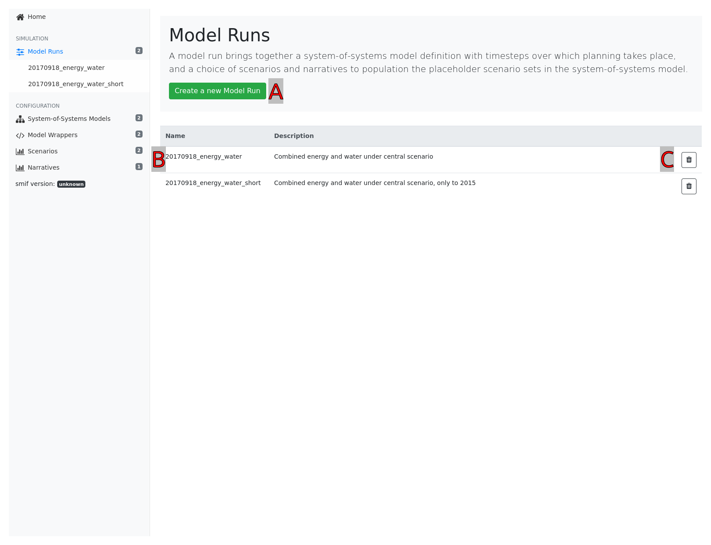
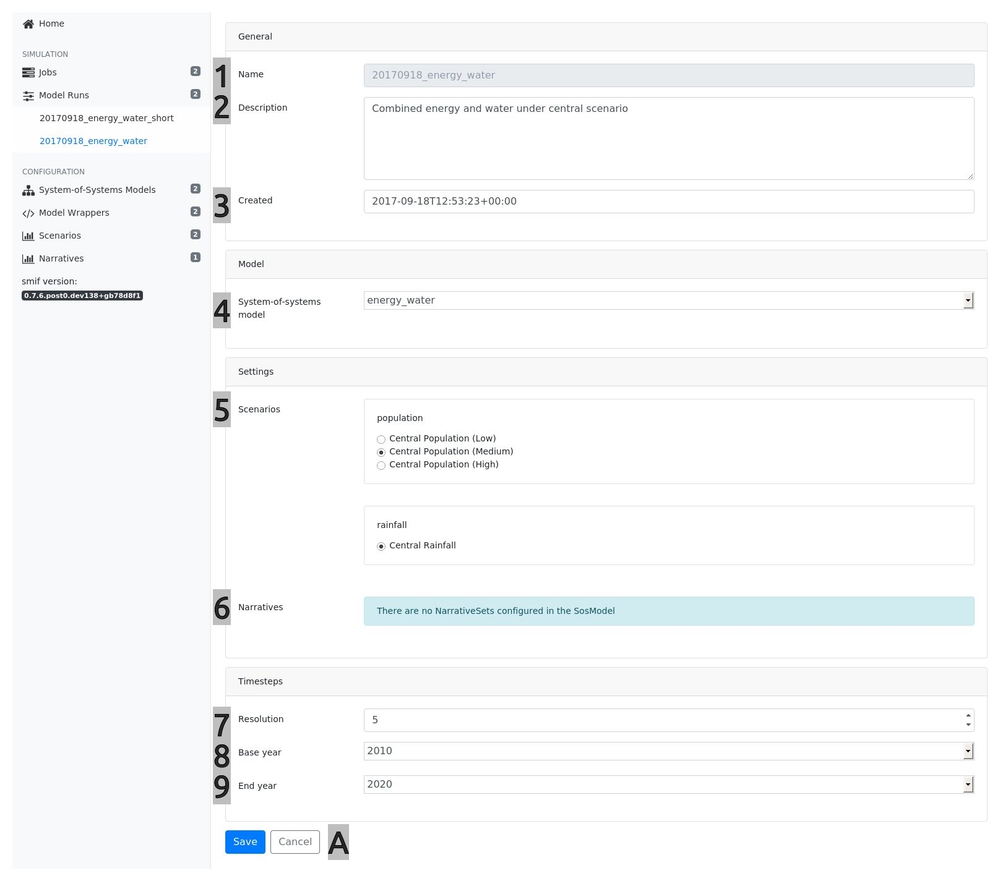
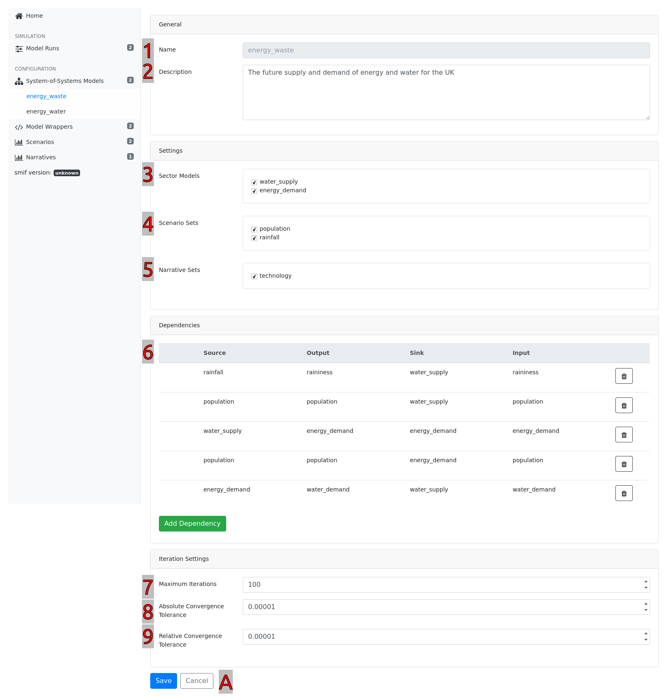
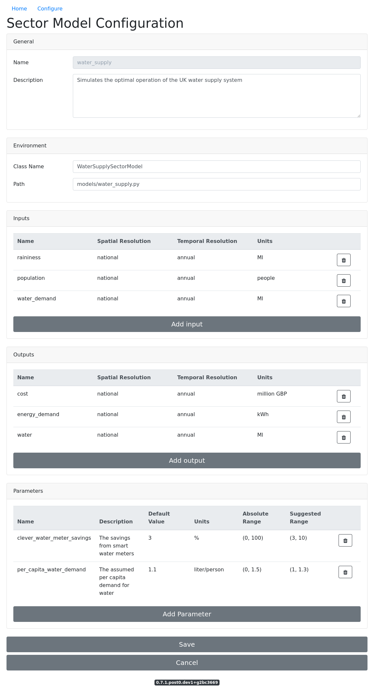

=====================
Project Configuration
=====================

There are three layers of configuration in order to use the simulation modelling
integration framework to conduct system-of-system modelling.

A project is the highest level container which holds all the elements required
to run models, configure simulation models and define system-of-system models.

The basic folder structure looks like this::

    project.yml
    /config
        /dimensions
            annual.yml
            country.yml
            oxfordshire.yml
        /model_runs
            energy_central.yml
            energy_water_cp_cr.yml
        /narratives
            technology.yml
        /scenarios
            climate.yml
            population.yml
            water_sector_energy_demand.yml
        /sector_models
            energy_demand.yml
            water_supply.yml
        /sos_models
            energy_water.yml
            energy.yml
    /data
        /coefficients
            ...
        /dimensions
            hourly.csv
            annual.csv
            lad.shp
        /initial_conditions
            energy_demand_existing.csv
            energy_supply_existing.csv
        /interventions
            energy_demand.csv
            energy_supply.csv
        /narratives
            energy_demand_high_tech.csv
            central_planning.csv
        /scenarios
            population_high.csv
            population_low.csv
        /strategies
            pipeline_2020.csv
    /models
        energy_demand.py
        water_supply.py
    /results
        /energy_central
            /energy_demand
                ...
            /water_supply
                ...

The Project File
----------------

This file holds a small amount of project-level configuration.

The project name is a unique identifier for this project.

Unit definitions references a file containing custom units, not included in
the Pint library default unit register (e.g. non-SI units).

Model Run
---------

A model run brings together a system-of-systems model definition with timesteps over which
planning takes place, and a choice of scenarios and narratives to population the placeholder
scenario sets in the system-of-systems model.

.. literalinclude:: ../src/smif/sample_project/config/model_runs/energy_central.yml
   :language: yaml

.. <<This figure can be regenerated using the script in docs/gui/screenshot.sh>>

    A model run overview

.. topic:: Hints

    [A] Create a new model run

    [B] Click on the row to edit an existing model run

    [C] Click on the bin icon to delete a configuration

.. <<This figure can be regenerated using the script in docs/gui/screenshot.sh>>

    The Model Run configuration

.. csv-table::
   :header:  #, Attribute, Notes
   :widths: 3, 10, 45

   1, Name, A unique name that identifies the Model Run configuration. Note: this field is non-editable.
   2, Description, A description that shortly describes the Model Run for future reference.
   3, Created, A timestamp that identifies at which time this Model Run was created. Note: this field is non-editable.
   4, System-of-System model, The System-of-Systems Model that this Model Run configuration is using.
   5, Scenarios, The selected Scenario for this Model Run within each of the available Scenario Sets. Note: Only the Scenario Sets that were configured in the selected System-of-System Model will be available here.
   6, Narrative, The selected Narratives for this Model Run within each of the available Narrative Sets. Note: Only the Narrative Sets that were configured in the selected System-of-System Model will be available here.
   7, Resolution, The number of years between each of the Timesteps.
   8, Base year, The Timestep where this Model Run must start the simulation.
   9, End year, The last Timestep that this Model Run must simulate.

.. topic:: Hints

    [A] "Save" will save changes to this configuration. Click "Cancel" to leave the
    configuration without saving.

Timesteps
~~~~~~~~~

A list of timesteps define the years in which planning takes place, and the simulation models
are executed.

.. literalinclude:: ../src/smif/sample_project/config/model_runs/energy_central.yml
   :language: yaml
   :lines: 4-7

Scenarios
~~~~~~~~~

For each scenario available in the contained system-of-systems model, one variant should be
chosen.

.. literalinclude:: ../src/smif/sample_project/config/model_runs/energy_central.yml
   :language: yaml
   :lines: 9-11

Narratives
~~~~~~~~~~

Narratives override the default values of parameters in simulation models.

For each narrative available in the project, any number of narrative variants can be chosen (or
none at all).

.. literalinclude:: ../src/smif/sample_project/config/model_runs/energy_central.yml
   :language: yaml
   :lines: 12

System-of-Systems Models
------------------------

A system-of-systems model collects together scenario sets and simulation models.
Users define dependencies between scenario and simulation models.

.. literalinclude:: ../src/smif/sample_project/config/sos_models/energy_water.yml
   :language: yaml

.. <<This figure can be regenerated using the script in docs/gui/screenshot.sh>>

    The System-of-System Model configuration

.. csv-table::
   :header:  "#", "Attribute", "Notes"
   :widths: 3, 10, 45

   1, Name, "A unique name that identifies the System-of-Systems model configuration. Note: this field is non-editable. See also :ref:`A System-of-Systems Model File`"
   2, Description, "A description that shortly describes the System-of-Systems model for future reference. See also :ref:`A System-of-Systems Model File`"
   3, Sector Models, "The selection of Simulation Models that are used in this System-of-Systems Model. See also :ref:`A System-of-Systems Model File`"
   4, Scenario Sets, "The selection of Scenario Sets that are used in this System-of-Systems Model. See also :ref:`A System-of-Systems Model File`"
   5, Narrative Sets, "The selection of Narrative Sets that are used in this System-of-Systems Model. See also :ref:`A System-of-Systems Model File`"
   6, Dependencies, "The list of Dependencies that are defined between sources and links. See also :ref:`Dependencies`"

.. topic:: Hints

    [A] "Add Dependency" opens a form to add a new dependency

    [B] "Save" will save changes to this configuration. Click "Cancel" to leave the
    configuration without saving.

Scenarios and Narratives
~~~~~~~~~~~~~~~~~~~~~~~~

Scenarios are the categories in which scenario data are organised. Choosing a scenario set
at this point allows different scenario data to be chosen in model runs which share the same
system-of-systems model configuration defintion.

.. literalinclude:: ../src/smif/sample_project/config/sos_models/energy_water.yml
   :language: yaml
   :lines: 3-7

Similarly, narratives can be made available if desired.

.. literalinclude:: ../src/smif/sample_project/config/sos_models/energy_water.yml
   :language: yaml
   :lines: 8-24

Simulation Models
~~~~~~~~~~~~~~~~~

This section contains a list of pre-configured simulation models which exist in the current
project.

.. literalinclude:: ../src/smif/sample_project/config/sos_models/energy_water.yml
   :language: yaml
   :lines: 25-27

Dependencies
~~~~~~~~~~~~

In this section, dependencies are defined between sources and sinks. For convenience, they
are split into scenario dependencies (where a model will receive data from a scenario) and
model dependencies (where a model will receive data from another model).

.. literalinclude:: ../src/smif/sample_project/config/sos_models/energy_water.yml
   :language: yaml
   :lines: 28-58

.. csv-table::
   :header: "Attribute", "Type", "Notes"
   :widths: 15, 10, 30

   source,	string,	 "The source of the data"
   source_output,	string,	 "The output in the source"
   sink,	string,	 "The model which depends on the source"
   sink_input,	string,	 "The input which should receive the data"

Simulation Models
-----------------

A model file contains all the configuration data necessary for smif to run the model, and link
the model to data sources and sinks. This file also contains a list of parameters, the 'knobs
and dials' the user wishes to expose to smif which can be adjusted in narratives. Intervention
files and initial condition files contain the collections of data that are needed to expose the
model to smif's decision making functionality.

.. <<This figure can be regenerated using the script in docs/gui/screenshot.sh>>

    The Model Wrapper configuration

.. csv-table::
   :header:  "#", "Attribute", "Notes"
   :widths: 3, 10, 45

   1, Name, "A unique name that identifies the simulation model that is wrapped. Note: this field is non-editable. See also :ref:`A Simulation Model File`"
   2, Description, "A description that shortly describes the simulation model for future reference. See also :ref:`A Simulation Model File`"
   3, Class Name, "Name of the Class that is used in the smif wrapper. See also :ref:`Wrapping a Sector Model: Overview`"
   4, Path, "The location of the python wrapper file. See also :ref:`Wrapping a Sector Model: Overview`"
   5, Inputs, "The simulation model inputs with their name, units and temporal-spatial resolution. See also :ref:`Inputs`"
   6, Outputs, "The simulation model outputs with their name, units and temporal-spatial resolution. See also :ref:`Outputs`"
   7, Parameters, "The simulation model parameters. See also :ref:`Parameters`"

.. topic:: Hints

    [A] "Add Input" to open a form to add a new input

    [B] "Add Output" to open a form to add a new output

    [C] "Add Parameter" to open a form to add a new parameter

    [D] "Save" to save changes to this configuration. Click on "Cancel" to leave the
    configuration without saving.

Inputs
~~~~~~

Define the collection of inputs required from external sources to run the model. Inputs are
defined with a name, spatial resolution, temporal-resolution and units.

.. literalinclude:: ../src/smif/sample_project/config/sector_models/water_supply.yml
   :language: yaml
   :lines: 6-16

.. csv-table::
   :header: "Attribute", "Type", "Notes"
   :widths: 15, 10, 30

   name, string, "A name for the input variable"
   dims, string, "A list of dimensions"
   dtype, string, "The data type"
   units, string, "The units required for the variable"
   absolute_range, tuple, "(optional) Raises an error if bounds exceeded"
   suggested_range,	tuple, "(optional) Provides a hint to a user as to sensible ranges"
   default_value,	float, "(optional) The default value for the parameter"

Outputs
~~~~~~~

Define the collection of output model values used for the purpose of metrics, for accounting
purposes, such as operational cost and emissions, or as the source of a dependency in another
model.

.. literalinclude:: ../src/smif/sample_project/config/sector_models/water_supply.yml
   :language: yaml
   :lines: 27-37

Outputs are defined with exactly the same attributes as inputs.

Parameters
~~~~~~~~~~

Parameters should all be configured with default values - these may be overridden by narratives
when a model is run.

.. literalinclude:: ../src/smif/sample_project/config/sector_models/water_supply.yml
   :language: yaml
   :lines: 53-64

Parameters are defined with exactly the same attributes as inputs and outputs.

Scenarios
---------

The ``config/scenarios`` folder contains scenario definitions. Data files for each of the
scenario variants are stored in ``data/scenarios``.

Here's an example of a population scenario which can provide consistent data for population
and population density, in three variants (high/medium/low):

.. literalinclude:: ../src/smif/sample_project/config/scenarios/population.yml
   :language: yaml

The list of variables that a scenario ``provides`` are defined exactly as model inputs, outputs
and parameters.

The filenames in the ``data`` section within the scenario definition point to CSV
(comma-separated-values) files stored in the ``data/scenarios`` folder. For example:

.. literalinclude:: ../src/smif/sample_project/data/scenarios/population_high.csv
   :language: text

Narratives
----------

The ``config/narratives`` folder contains narrative definitions. Data files for each of the
variants are stored in ``data/narratives``.

.. literalinclude:: ../src/smif/sample_project/config/narratives/technology.yml
   :language: yaml

A narrative file contains references to 0 or more parameters defined in the simulation models.
Parameters might include system-wide constants such as emission coefficients or exchange rates,
and parameters used by a single model, such as technology energy efficiencies.

Value specified in the narrative file override the default values specified in the simulation
model configuration. If more than one narrative file is selected in the sos model
configuration, then values in later files override values in earlier files.

.. literalinclude:: ../src/smif/sample_project/data/narratives/high_tech_dsm.yml
   :language: yaml

Dimensions
----------

Dimensions are used in the metadata that describes model inputs, outputs and parameters.

The ``config/dimensions`` folder contains dimenion definitions. The ``data/dimensions`` folder
contains the list of coordinates which index the dimension, along with optional metadata that
can allow conversion between different dimensions of the same type.

Dimension config includes a name and brief description, along with a path to the file in
``data/dimensions`` which defines the coordinates elements:

.. literalinclude:: ../src/smif/sample_project/config/dimensions/annual.yml
   :language: yaml

Spatial and temporal dimensions are commonly used to define inputs or outputs which carry
information about a variable which varies over time (intervals) and/or space (locations or
regions).

Temporal dimensions
~~~~~~~~~~~~~~~~~~~

A temporal dimension definition specifies the mapping of model timesteps to durations within a
year (assuming that each planning timestep models 365 days: no extra day in leap years, no leap
seconds).

Use ISO 8601 [1]_ duration format to specify periods::

    P[n]Y[n]M[n]DT[n]H[n]M[n]S

For example:

.. literalinclude:: ../src/smif/sample_project/data/interval_definitions/annual_intervals.csv
   :language: text

In this example, the interval with id ``1`` begins in the first hour of the year and ends in
the last hour of the year. This represents one, year-long interval.

.. csv-table::
   :header: "Attribute", "Type", "Notes"
   :widths: 15, 10, 30

   id, string, "The unique identifier used by the simulation model"
   start_hour, string, "Period since beginning of year"
   end_hour, string, "Period since beginning of year"

Spatial dimensions
~~~~~~~~~~~~~~~~~~

Spatial dimensions define the set of regions used to index a model variable. The spatial
resolution of the model may be implicit, and even a national model needs to have a national
region defined.

The file format must be possible to parse with GDAL, and must contain an attribute "name" to
use as an identifier for the region.

Interventions
-------------

Interventions are the atomic units which comprise the infrastructure systems in the simulation
models. Interventions can represent physical assets such as pipes, and lines (edges in a
network) or power stations and reservoirs (nodes in a network). Interventions can also
represent intangibles which affects the operation of a system, such as a policy.

An exhaustive list of the interventions (often infrastructure assets) should be defined. These
are represented internally in the system-of-systems model, collected into a gazateer and allow
the framework to reason on infrastructure assets across all sectors.

Interventions are instances of :class:`-smif.intervention.Intervention` and are held in
:class:`-smif.intervention.InterventionRegister`. Interventions include investments in assets,
supply side efficiency improvements, but not demand side management (these are incorporated in
the strategies).

Define all possible interventions in an ``*.csv`` file in the ``data/interventions``
For example:

.. literalinclude:: ../src/smif/sample_project/data/interventions/water_supply.csv
   :language: text
   :lines: 1-3

After name, columns are optional and will be used for any attributes. Another example:

.. literalinclude:: ../src/smif/sample_project/data/interventions/energy_supply.csv
   :language: csv
   :lines: 1-5

Note that the ``_value`` and ``_unit`` suffixes of the column names are used to unpack the data
internally.

Some attributes may be required:

- technical_lifetime
  (years are assumed as unit and can be omitted)

Initial Conditions
------------------

Initial conditions define the interventions to be applied before any decision process starts.
Depending on the model, it may be possible to compose the entire system of interest from a
list of initial conditions.

.. literalinclude:: ../src/smif/sample_project/data/initial_conditions/water_supply_oxford.csv
   :language: text

References
----------
.. [1] https://en.wikipedia.org/wiki/ISO_8601#Durations
